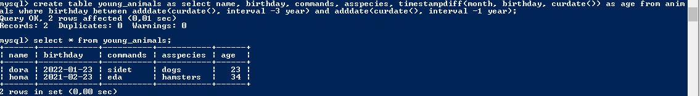

# Итоговая работа
### Задание №1

### Задание №2

### Задание №3

### Задание №4

### Задание №5
Задание №1
- cat > home_animals
- cat > pack_animals
- cat home_animals pack_animals > animals
- mv animals mans_friends

Задание №2
- sudo mkdir animals
- sudo mv mans_friends ./animals/

Задание №3
- sudo wget https://dev.mysql.com/get/mysql-apt-config_0.8.24-1_all.deb
- sudo dpkg -i mysql-apt-config_0.8.24-1_all.deb

Задание №4
- sudo dpkg -P mysql-apt-config

### Задание №6

### Задание №7

### Задание №8

### Задание №9

### Задание №10

### Задание №11

